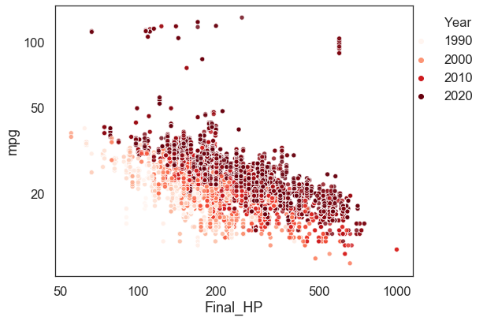

# Car Features

This is an analysis of the Car features and price dataset from Kaggle. My aims for the dataset are
the following 
- Clean the dataset 
- Conduct Univariate and Bivariate analysis to understand what factors have an effect on pricing and fuel economy 
- Use Machine Learning algorithms to find Predictive features for Fuel Economy

## Results Summary
### Multivariate Analysis 

Using multivariate analysis, there are two very clear and striking observations 
1. If we compare MSRP vs HP, we see an increasing trend. But what is more interesting is that when plotted on a log-log plot, we clearly see two groups of cars. Labeling the year and the number of cylinders, we see
  - The grouping is based on the years, one group is mostly newer cars, and the other is older cars
  - Horsepower is correlated to number of cylinders, with the exception being electric cars. 

2. A comparision of HP vs MPG definitely shows an expected negative correlation. However, once we label the time, we see 
  - The newer cars have higher HP and higher MPG. 
  - There is no relationship between number of cylinders and time. This suggests a role of forced induction (turbo and super charging) in new cars to increase power without increasing number of cylinders. 
  
  

### Supervised machine learning

Lastly, I perfomed supervised machine learning to investigate what the main factors that affect the MPG of the car. 
Using different methods, I determined Random Forests had the best accuracy, precision, recall and F1 score (>0.96). The top features are shown in the plot below. 

