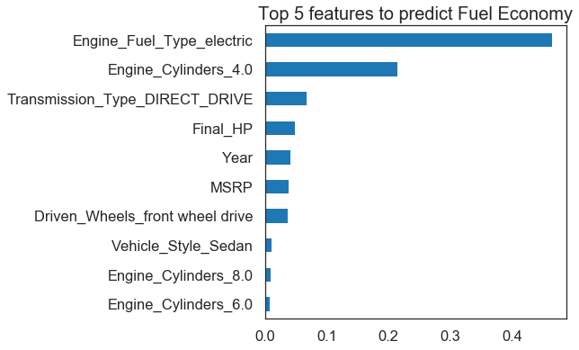

# Car Features

This is an analysis of the Car features and price dataset from Kaggle. My aims for the dataset are
the following 
- Clean the dataset 
- Conduct Univariate and Bivariate analysis to understand what factors have an effect on pricing and fuel economy 
- Use Machine Learning algorithms to find Predictive features for Fuel Economy

