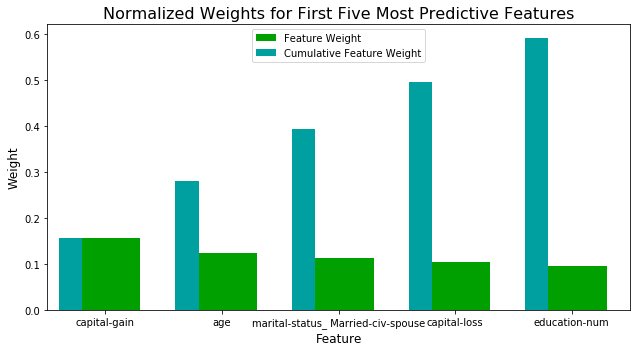

## Finding_donors

The aim of this project is to utilize supervised machine learning algorithms to help CharityML (a fictitious charity organization) identify people most likely to donate to their cause.
I explore using 
- Random forest
- Gradient Boosting Classifiers
- Logistic Regression 

Based on the time required to run the classified and accuracy and precision of the model, I determined that Gradient boosting classifier is the best model.

Lastly, I run grid search to optimize the model and determine the top 5 predictive features. 

__Below is a figure showing the top figure predictive features__

